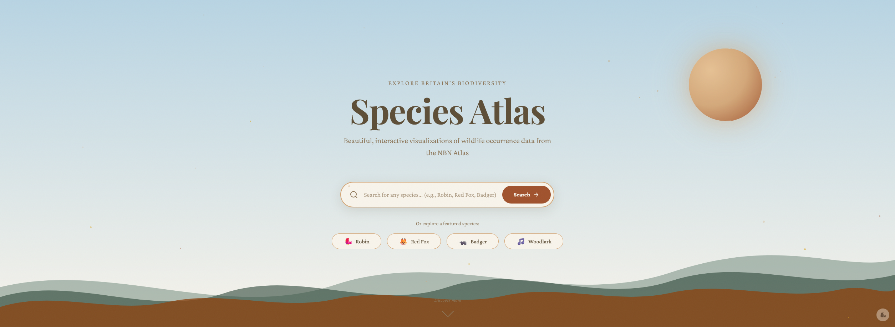
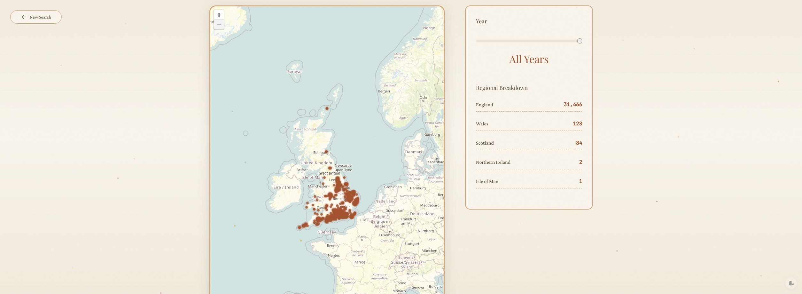
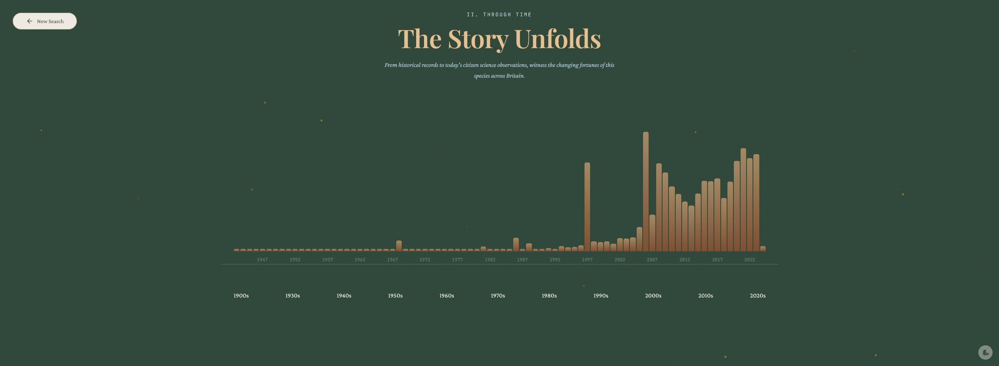
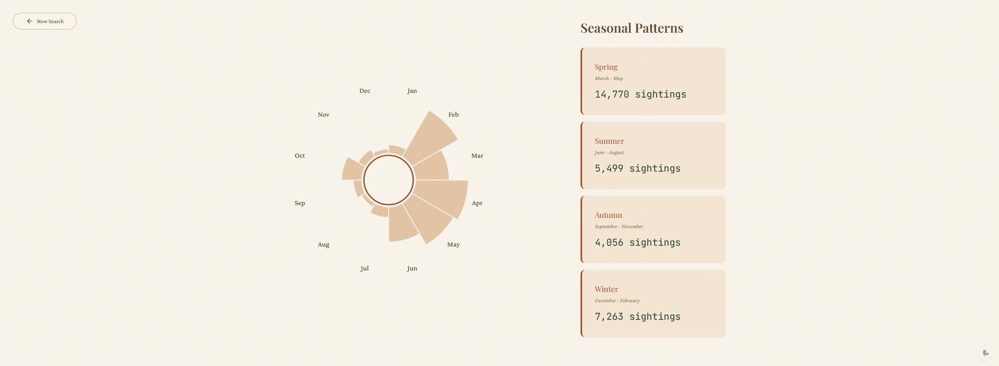
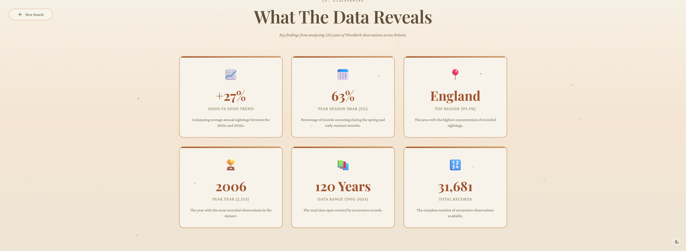
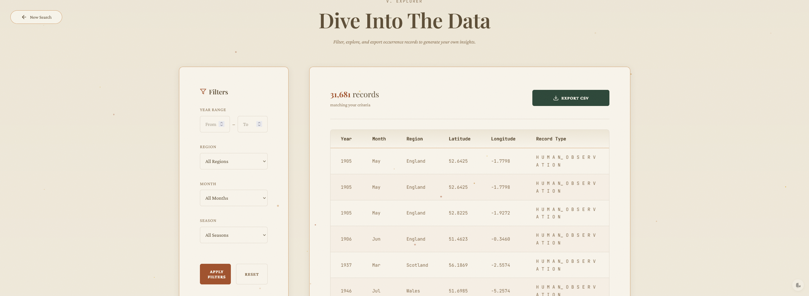

# NBN Atlas Species Explorer

An interactive data visualization for exploring any species from the [NBN Atlas](https://nbnatlas.org/). Search for any species and visualize their occurrence records with beautiful maps, timelines, and statistical insights.

  

## Features

- **Universal Species Search** — Search for any species by common name, scientific name, or browse suggestions
- **Interactive Map** — Explore sightings across the UK & Ireland using Leaflet/OpenStreetMap with a year slider to travel through time
- **Timeline Visualization** — See how sighting patterns have changed over the years
- **Seasonal Wheel** — Discover when species are most commonly spotted throughout the year
- **Key Insights** — Automatically generated statistical analysis for any species
- **Data Explorer** — Filter, sort, and export occurrence data to CSV for your own analysis
- **Large Dataset Handling** — Smart modal for species with 50,000+ records, allowing you to:
  - Select a specific year range
  - Limit by record count (10k, 25k, 50k, 100k)
  - Load all records with progress tracking

## Screenshots

### Landing Page


### Interactive Map


### Timeline Visualization


### Seasonal Wheel


### Key Insights


### Data Explorer


## Quick Start

Requires [Node.js](https://nodejs.org/) (v18 or later recommended).

```bash
# Clone the repository
git clone https://github.com/saulsmcouk/species-atlas.git
cd species-atlas

# Install dependencies
npm install

# Start the server
node index.js
```

Open http://localhost:3000 in your browser.

## How It Works

1. **Search or Browse** — Use the search box to find any species, or click on featured examples
2. **Data Loading** — The app fetches real-time data from the NBN Atlas API
3. **Large Datasets** — For species with 50,000+ records, a modal lets you choose what to load
4. **Visualize** — Explore the data through interactive map, timeline, seasonal wheel, and more
5. **Export** — Use the Data Explorer to filter and export records as CSV

## Project Structure

```
nbn-atlas-viewer/
├── public/
│   ├── index.html          # Main SPA with landing page + visualization
│   ├── css/
│   │   └── styles.css      # All styling (~2200 lines)
│   └── js/
│       ├── app.js          # Main SpeciesExplorer class
│       └── animations.js   # Flying birds & visual effects
├── index.js                # Express server with API proxies
└── package.json
```

## Data Source

All occurrence data is sourced in real-time from the [NBN Atlas API](https://api.nbnatlas.org/). The app uses:
- Species search endpoint for finding species by name/GUID
- Faceted occurrence queries for statistics
- Year-by-year occurrence fetching to handle large datasets

**Note:** Data is filtered to UK & Ireland records only.

## Design

The visualization uses a naturalist field journal aesthetic with:
- **Typography:** Playfair Display (headings), Crimson Pro (body), JetBrains Mono (data)
- **Palette:** Parchment, burnt sienna, golden amber, forest deep
- **Animations:** Flying SVG birds, floating particles, scroll-triggered reveals

## API Endpoints

The Express server proxies requests to NBN Atlas:

| Endpoint | Description |
|----------|-------------|
| `GET /api/species/search` | Search species by name/GUID |
| `GET /api/species/:guid/facets` | Get occurrence statistics for a species |
| `GET /api/species/:guid/occurrences/:year` | Get occurrences for a specific year |

## Requirements

- Node.js 18+ (uses native fetch)
- npm

## Data License

All occurrence data from the NBN Atlas is licensed under [CC BY 4.0](https://creativecommons.org/licenses/by/4.0/). When using or citing this data, please acknowledge the NBN Atlas and its data partners.

For more information, see:
- [NBN Atlas Terms of Use](https://docs.nbnatlas.org/nbn-atlas-terms-of-use/)
- [Data Partners Registry](https://registry.nbnatlas.org/)

## License

This visualization tool is MIT licensed. NBN Atlas data remains under CC BY 4.0.

## Acknowledgments

- Data provided by the [NBN Atlas](https://nbnatlas.org/) under [CC BY 4.0](https://creativecommons.org/licenses/by/4.0/)
- Map tiles © [OpenStreetMap](https://www.openstreetmap.org/copyright) contributors (ODbL)
- Location search powered by [Nominatim](https://nominatim.org/) (ODbL)
- Interactive maps by [Leaflet](https://leafletjs.com) (BSD-2-Clause)
- Built with 🤍 for nature
